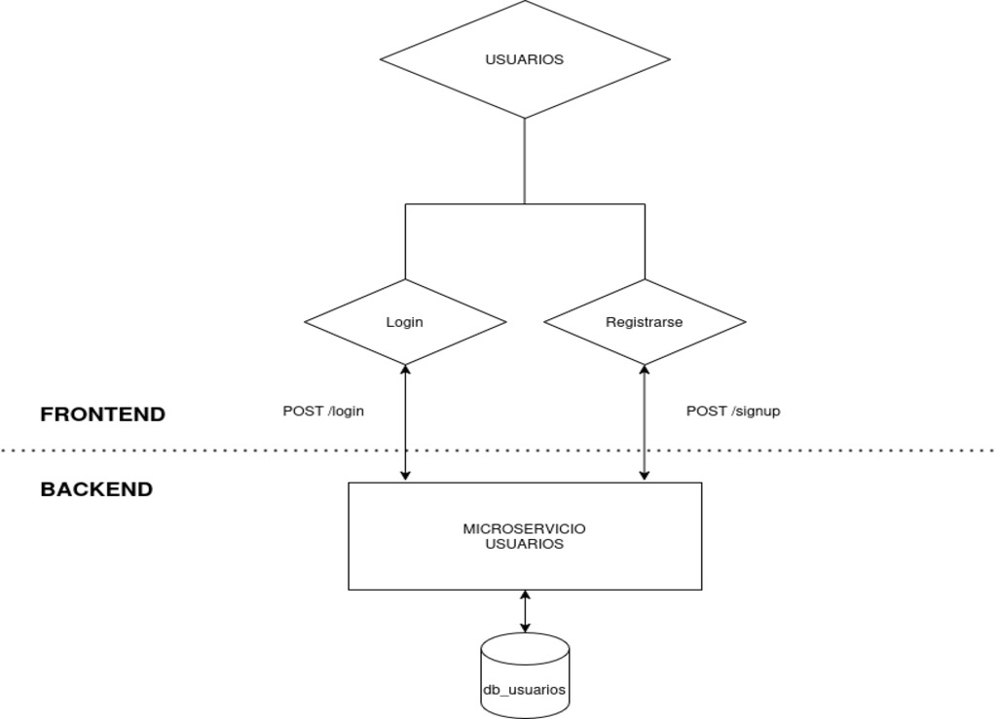
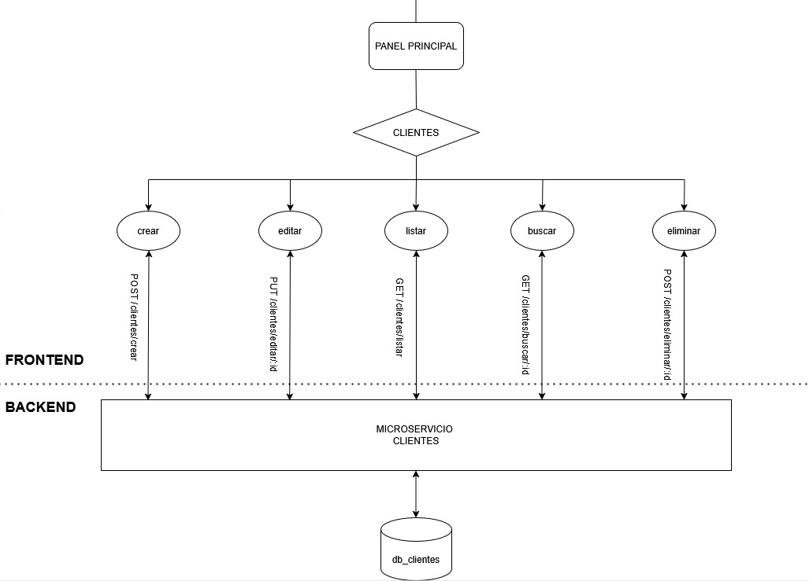
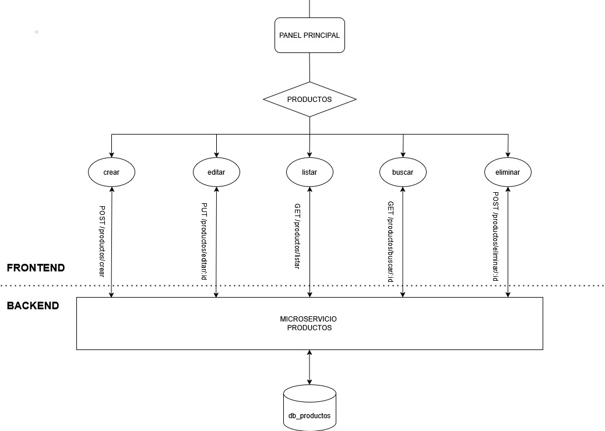
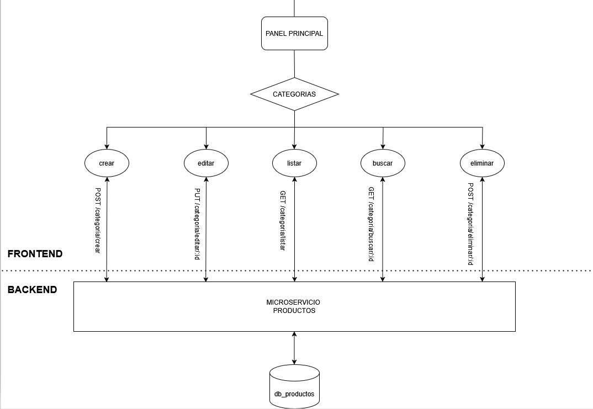
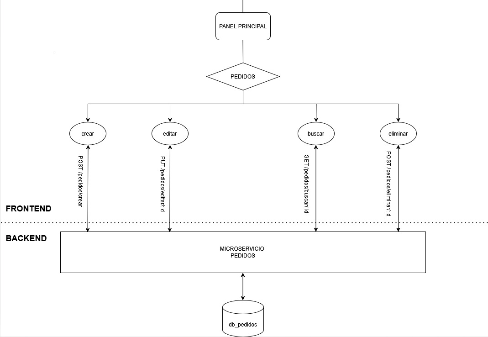
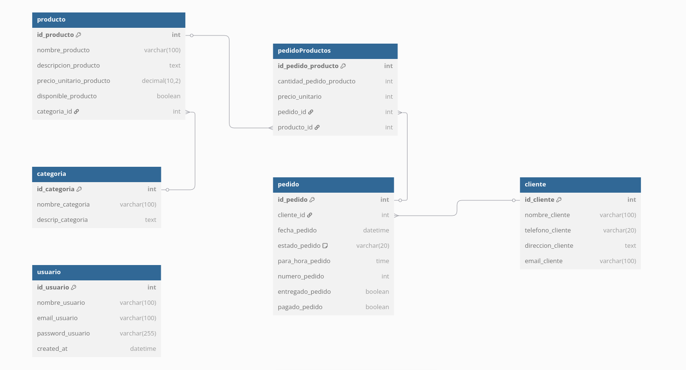

# Gestor de ventas para Rotisería
---
## Resumen

Este Trabajo Práctico Final correspondiente a la materia Programación 3 tiene como objetivo desarrollar una aplicación web que permita a una rotisería gestionar eficientemente los pedidos diarios, sus productos y los datos de los clientes.

La aplicación incluye funcionalidades como autenticación de usuarios, registro, operaciones CRUD sobre productos y clientes, gestión de pedidos diarios y búsqueda de pedidos por fecha.

---

## Tecnologías Utilizadas

Para el desarrollo del backend optamos por utilizar Django ya que incorpora de manera muy comoda y fluida la comunicación y diseño de la base de datos con sus ORM's incorporados, además de que cuenta con el ecosistema de analisis de datos de python que nos permite expandir con mucha comodidad las funcionalidades de la aplicación base con el fin de promoción.

---

## Diagrama de Arquitectura

A continuación se presenta un bosquejo del diagrama de arquitectura que representa la estructura general de la aplicación, separando claramente el frontend del backend y mostrando los flujos principales entre las distintas funcionalidades:

Microservicio Usuarios:

Microservicio Clientes:

Microservicio Productos:

Microservicio Pedidos.

---

## Diagrama Entidad-Relacion de la Base de Datos

Presentamos el esquema que representa las diversas entidades y relaciones que conforman los circuitos internos de la aplicación:

---

## Autores

- [Comas Tavella Juan Cruz](https://github.com/juancruzct12)
- [Facundo Martinez Nahuel Larroza](https://github.com/facu24fm)
- [Iván Gabriel Peceto](https://github.com/ivanPeceto)

---

## Scripts externos

- [wait-for-it](https://github.com/vishnubob/wait-for-it): Para la conexión entre microservicios y bases de datos.

