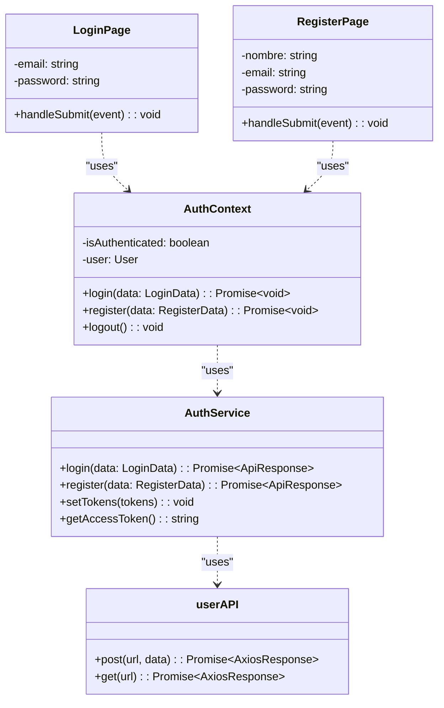

```mermaid
classDiagram
    class LoginPage {
        -email: string
        -password: string
        +handleSubmit(event): void
    }
    
    class RegisterPage {
	    -nombre: string
        -email: string
        -password: string
        +handleSubmit(event): void
    }

    class AuthContext {
        -isAuthenticated: boolean
        -user: User
        +login(data: LoginData): Promise~void~
        +register(data: RegisterData): Promise~void~
        +logout(): void
    }

    class AuthService {
        +login(data: LoginData): Promise~ApiResponse~
        +register(data: RegisterData): Promise~ApiResponse~
        +setTokens(tokens): void
        +getAccessToken(): string
    }

    class userAPI {
        +post(url, data): Promise~AxiosResponse~
        +get(url): Promise~AxiosResponse~
    }

    LoginPage ..> AuthContext : "uses"
	RegisterPage..> AuthContext: "uses"
	AuthContext ..> AuthService : "uses"
    AuthService ..> userAPI : "uses"
``` 