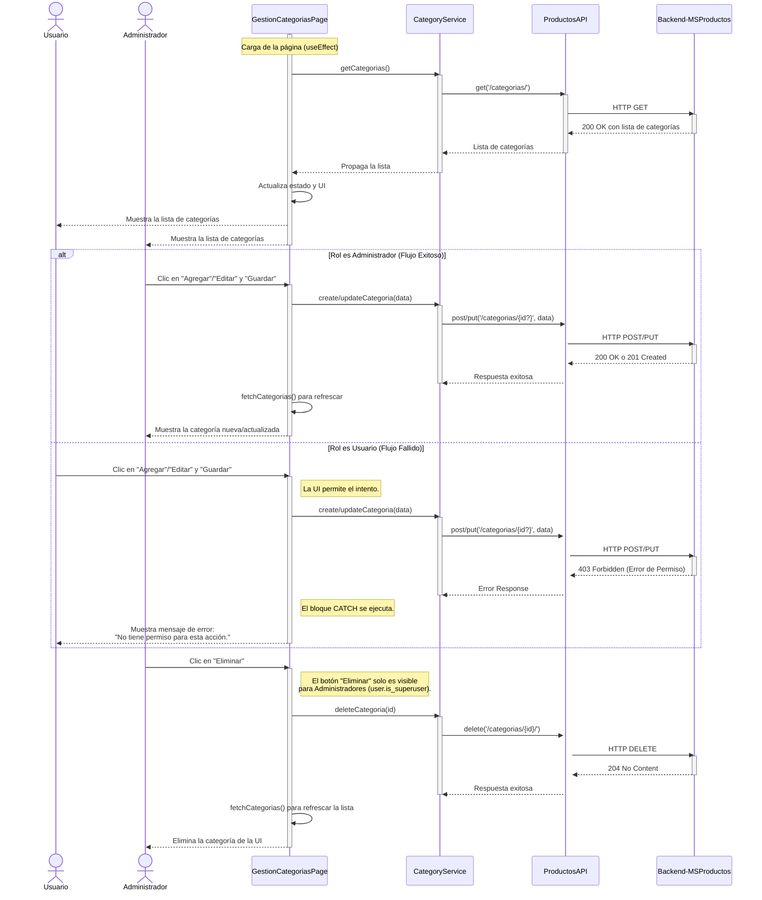

```mermaid
sequenceDiagram
    actor Usuario
    actor Administrador
    participant page as GestionCategoriasPage
    participant categoryService as CategoryService
	    participant productosAPI as ProductosAPI
    participant Backend as Backend-MSProductos

    %% --- Carga Inicial de Datos (Común y exitoso para ambos roles) ---
    activate page
    Note over page: Carga de la página (useEffect)
    page->>categoryService: getCategorias()
    activate categoryService
    categoryService->>productosAPI: get('/categorias/')
    activate productosAPI
    productosAPI->>Backend: HTTP GET
    activate Backend
    Backend-->>productosAPI: 200 OK con lista de categorías
    deactivate Backend
    productosAPI-->>categoryService: Lista de categorías
    deactivate productosAPI
    categoryService-->>page: Propaga la lista
    deactivate categoryService
    page->>page: Actualiza estado y UI
    page-->>Usuario: Muestra la lista de categorías
    page-->>Administrador: Muestra la lista de categorías
    deactivate page
    %% --- Fin de Carga Inicial ---

    %% --- Intento de Creación/Edición de Categoría ---
    alt Rol es Administrador (Flujo Exitoso)
        Administrador->>page: Clic en "Agregar"/"Editar" y "Guardar"
        activate page
        page->>categoryService: create/updateCategoria(data)
        activate categoryService
        categoryService->>productosAPI: post/put('/categorias/{id?}', data)
        activate productosAPI
        productosAPI->>Backend: HTTP POST/PUT
        activate Backend
        Backend-->>productosAPI: 200 OK o 201 Created
        deactivate Backend
        productosAPI-->>categoryService: Respuesta exitosa
        deactivate categoryService
        page->>page: fetchCategorias() para refrescar
        page-->>Administrador: Muestra la categoría nueva/actualizada
        deactivate page
    else Rol es Usuario (Flujo Fallido)
        Usuario->>page: Clic en "Agregar"/"Editar" y "Guardar"
        activate page
        Note right of page: La UI permite el intento.
        page->>categoryService: create/updateCategoria(data)
        activate categoryService
        categoryService->>productosAPI: post/put('/categorias/{id?}', data)
        activate productosAPI
        productosAPI->>Backend: HTTP POST/PUT
        activate Backend
        Backend-->>productosAPI: 403 Forbidden (Error de Permiso)
        deactivate Backend
        productosAPI-->>categoryService: Error Response
        deactivate categoryService
        Note right of page: El bloque CATCH se ejecuta.
        page-->>Usuario: Muestra mensaje de error:<br/>"No tiene permiso para esta acción."
        deactivate page
    end
    %% --- Fin de Intento de Creación/Edición ---

    %% --- Intento de Eliminación de Categoría (Solo Administrador) ---
    Administrador->>page: Clic en "Eliminar"
    activate page
    Note right of page: El botón "Eliminar" solo es visible<br/>para Administradores (user.is_superuser).
    page->>categoryService: deleteCategoria(id)
    activate categoryService
    categoryService->>productosAPI: delete('/categorias/{id}/')
    activate productosAPI
    productosAPI->>Backend: HTTP DELETE
    activate Backend
    Backend-->>productosAPI: 204 No Content
    deactivate Backend
    productosAPI-->>categoryService: Respuesta exitosa
    deactivate categoryService
    page->>page: fetchCategorias() para refrescar la lista
    page-->>Administrador: Elimina la categoría de la UI
    deactivate page
    %% --- Fin de Intento de Eliminación ---
```