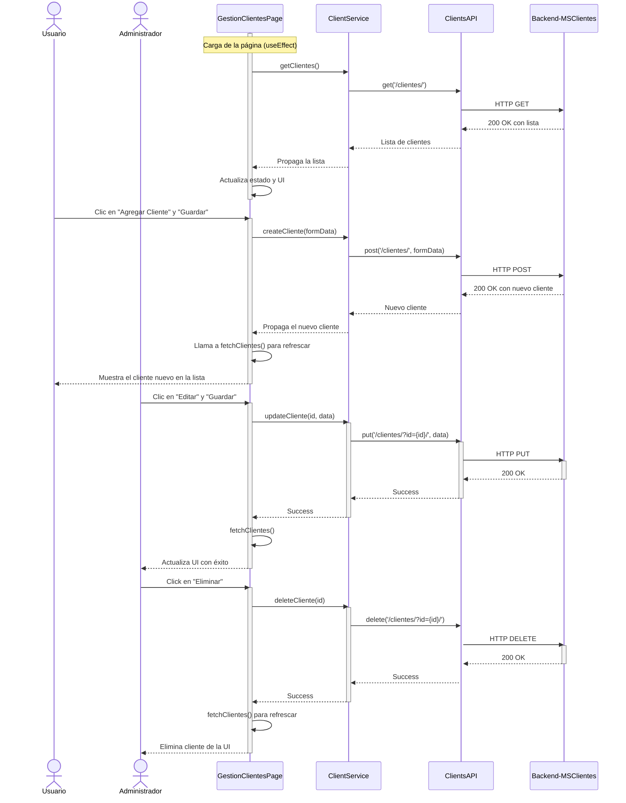

```mermaid
sequenceDiagram
    actor Usuario
    actor Administrador
    participant page as GestionClientesPage
    participant clientService as ClientService
    participant clientsAPI as ClientsAPI
    participant Backend as Backend-MSClientes

    %% --- Carga y Creación (Flujos comunes y exitosos para ambos) ---

	activate page
	Note over page: Carga de la página (useEffect)
	page->>clientService: getClientes()
	clientService->>clientsAPI: get('/clientes/')
	clientsAPI->>Backend: HTTP GET
	Backend-->>clientsAPI: 200 OK con lista
	clientsAPI-->>clientService: Lista de clientes
	clientService-->>page: Propaga la lista
	page->>page: Actualiza estado y UI
	deactivate page

	Usuario->>page: Clic en "Agregar Cliente" y "Guardar"
	activate page
	page->>clientService: createCliente(formData)
	clientService->>clientsAPI: post('/clientes/', formData)
	clientsAPI->>Backend: HTTP POST
	Backend-->>clientsAPI: 200 OK con nuevo cliente
	clientsAPI-->>clientService: Nuevo cliente
	clientService-->>page: Propaga el nuevo cliente
	page->>page: Llama a fetchClientes() para refrescar
	page-->>Usuario: Muestra el cliente nuevo en la lista
	deactivate page


%% --- Flujo de Edición (Lógica diferenciada por rol) ---

	Administrador->>page: Clic en "Editar" y "Guardar"
	activate page
	page->>clientService: updateCliente(id, data)
	activate clientService
	clientService->>clientsAPI: put('/clientes/?id={id}/', data)
	activate clientsAPI
	clientsAPI->>Backend: HTTP PUT
	activate Backend
	Backend-->>clientsAPI: 200 OK
	deactivate Backend
	clientsAPI-->>clientService: Success
	deactivate clientsAPI
	clientService-->>page: Success
	deactivate clientService
	page->>page: fetchClientes()
	page-->>Administrador: Actualiza UI con éxito
	deactivate page


%% --- Flujo de Eliminar (Lógica de UI) ---

	Administrador->>page: Click en "Eliminar"
	activate page
	page->>clientService: deleteCliente(id)
	activate clientService
	clientService->>clientsAPI: delete('/clientes/?id={id}/')
	activate clientsAPI
	clientsAPI->>Backend: HTTP DELETE
	activate Backend
	Backend-->>clientsAPI: 200 OK
	deactivate Backend
	clientsAPI-->>clientService: Success
	clientService-->>page: Success
	deactivate clientService
	page->>page: fetchClientes() para refrescar
	page-->>Administrador: Elimina cliente de la UI
	deactivate page

```