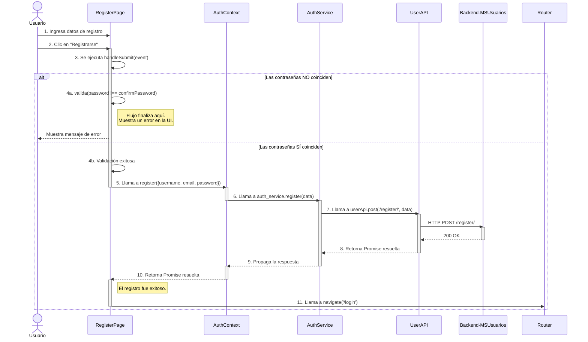

```mermaid
sequenceDiagram
    actor Usuario
    participant registerPage as RegisterPage
    participant authContext as AuthContext
    participant authService as AuthService
    participant userApi as UserAPI
    participant Backend as Backend-MSUsuarios
    participant router as Router

    Usuario->>registerPage: 1. Ingresa datos de registro
    Usuario->>registerPage: 2. Clic en "Registrarse"
    activate registerPage

    registerPage->>registerPage: 3. Se ejecuta handleSubmit(event)

    alt Las contraseñas NO coinciden
        registerPage->>registerPage: 4a. valida(password !== confirmPassword)
        Note right of registerPage: Flujo finaliza aquí.<br/>Muestra un error en la UI.
        registerPage-->>Usuario: Muestra mensaje de error
    else Las contraseñas SÍ coinciden
        registerPage->>registerPage: 4b. Validación exitosa
        registerPage->>authContext: 5. Llama a register({username, email, password})
        deactivate registerPage
        
        activate authContext
        authContext->>authService: 6. Llama a auth_service.register(data)
        deactivate authContext
        
        activate authService
        authService->>userApi: 7. Llama a userApi.post('/register/', data)
        activate userApi
        userApi->>Backend: HTTP POST /register/
        activate Backend
        Backend-->>userApi: 200 OK
        deactivate Backend
        userApi-->>authService: 8. Retorna Promise resuelta
        deactivate userApi
        
        authService-->>authContext: 9. Propaga la respuesta
        deactivate authService
        
        activate authContext
        authContext-->>registerPage: 10. Retorna Promise resuelta
        deactivate authContext
        
        activate registerPage
        Note right of registerPage: El registro fue exitoso.
        registerPage->>router: 11. Llama a navigate('/login')
        deactivate registerPage
    end
```