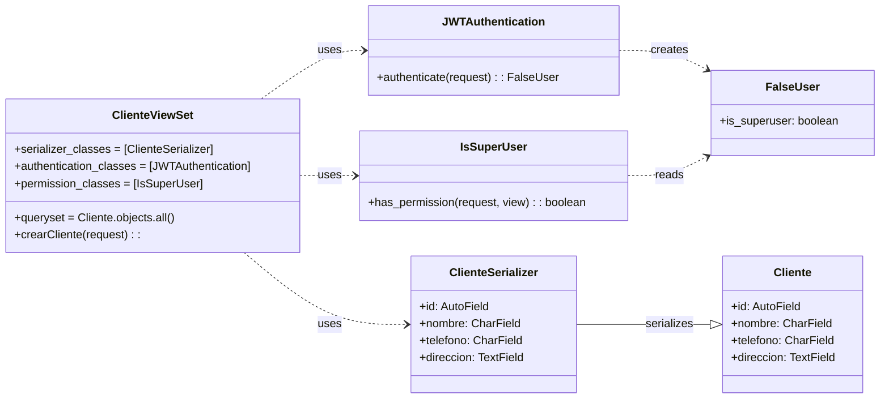

```mermaid
classDiagram
    direction LR

	class ClienteViewSet {
		+queryset = Cliente.objects.all()
		+serializer_classes = [ClienteSerializer]
		+authentication_classes = [JWTAuthentication]
		+permission_classes = [IsSuperUser]
		+crearCliente(request): 
	}

	class ClienteSerializer {
		+id: AutoField
		+nombre: CharField
		+telefono: CharField
		+direccion: TextField
	 }
	  
	 class Cliente {
		+id: AutoField
		+nombre: CharField
		+telefono: CharField
		+direccion: TextField
	  }

	class JWTAuthentication {
		+authenticate(request): FalseUser
	}
	 class FalseUser {
		+is_superuser: boolean
	}

	class IsSuperUser {
		+has_permission(request, view): boolean
	}  
            
    ClienteViewSet ..> JWTAuthentication : uses
    ClienteViewSet ..> IsSuperUser : uses
    ClienteViewSet ..> ClienteSerializer : uses
    ClienteSerializer --|> Cliente : serializes
    JWTAuthentication ..> FalseUser : creates
    IsSuperUser ..> FalseUser : reads
```