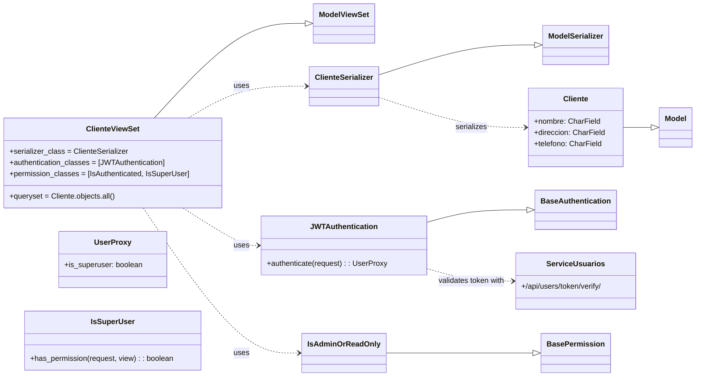

```mermaid
classDiagram
    direction LR
		
	class ClienteViewSet {
		+queryset = Cliente.objects.all()
		+serializer_class = ClienteSerializer
		+authentication_classes = [JWTAuthentication]
		+permission_classes = [IsAuthenticated, IsSuperUser]
	}
	
	class ClienteSerializer {
	}
	
	class Cliente {
		+nombre: CharField
		+direccion: CharField
		+telefono: CharField
	}
	
	
	
	class JWTAuthentication {
		+authenticate(request): UserProxy 
	} 
		
	class UserProxy {

		 +is_superuser: boolean 
	}
	
	
	
	class IsSuperUser {
		+has_permission(request, view): boolean
	}
	
	
	
	class ServiceUsuarios {
	+/api/users/token/verify/
	}
	


    ClienteViewSet --|> ModelViewSet
    ClienteSerializer --|> ModelSerializer
    Cliente --|> Model
    JWTAuthentication --|> BaseAuthentication
    IsAdminOrReadOnly --|> BasePermission


    ClienteViewSet ..> ClienteSerializer : uses
    ClienteViewSet ..> JWTAuthentication : uses
    ClienteViewSet ..> IsAdminOrReadOnly : uses
    ClienteSerializer ..> Cliente : serializes


    JWTAuthentication ..> ServiceUsuarios : validates token with
```