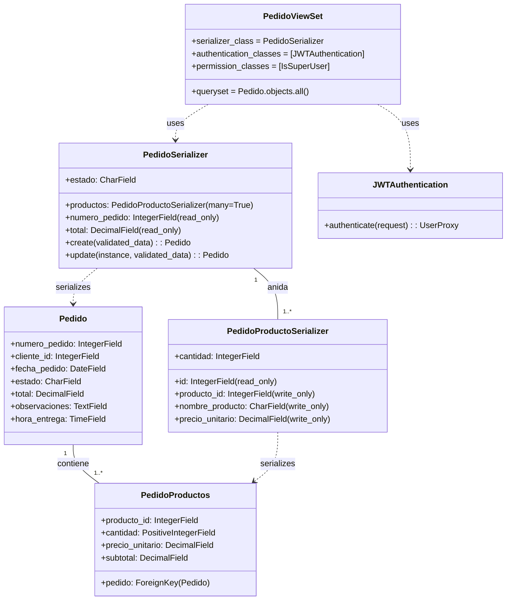

```mermaid
classDiagram
    direction TD

	class Pedido {
		+numero_pedido: IntegerField
		+cliente_id: IntegerField
		+fecha_pedido: DateField
		+estado: CharField
		+total: DecimalField
		+observaciones: TextField
		+hora_entrega: TimeField
	}
	
	class PedidoProductos {
		+pedido: ForeignKey(Pedido)
		+producto_id: IntegerField
		+cantidad: PositiveIntegerField
		+precio_unitario: DecimalField
		+subtotal: DecimalField
	}
	
	class PedidoSerializer {
		+productos: PedidoProductoSerializer(many=True)
		+numero_pedido: IntegerField (read_only)
		+estado: CharField
		+total: DecimalField (read_only)
		+create(validated_data): Pedido
		+update(instance, validated_data): Pedido
	}
	
	class PedidoProductoSerializer {
		+id: IntegerField (read_only)
		+producto_id: IntegerField (write_only)
		+nombre_producto: CharField (write_only)
		+precio_unitario: DecimalField (write_only)
		+cantidad: IntegerField
	}
	
	class PedidoViewSet {
		+queryset = Pedido.objects.all()
		+serializer_class = PedidoSerializer
		+authentication_classes = [JWTAuthentication]
		+permission_classes = [IsSuperUser]
	}
	
	class JWTAuthentication {
		+authenticate(request): UserProxy
	}

    Pedido "1" -- "1..*" PedidoProductos : contiene
    PedidoViewSet ..> PedidoSerializer : uses
    PedidoViewSet ..> JWTAuthentication : uses
    PedidoSerializer "1" -- "1..*" PedidoProductoSerializer : anida
    PedidoSerializer ..> Pedido : serializes
    PedidoProductoSerializer ..> PedidoProductos : serializes
```