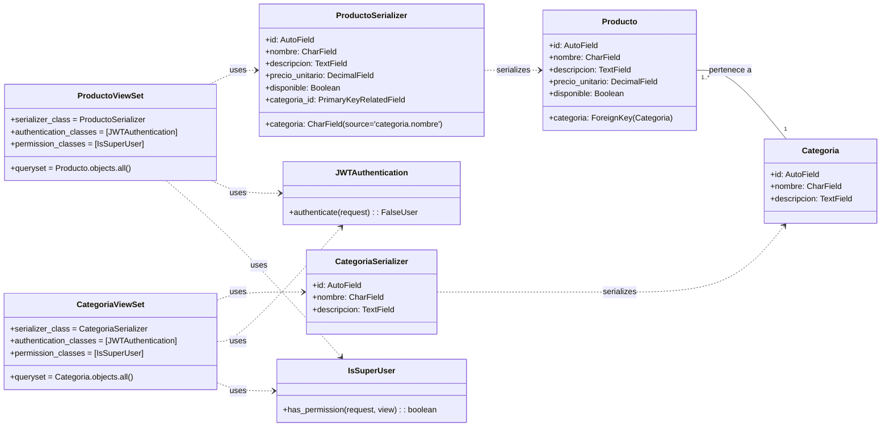

```mermaid
classDiagram
    direction LR

	class ProductoViewSet {
		+queryset = Producto.objects.all()
		+serializer_class = ProductoSerializer
		+authentication_classes = [JWTAuthentication]
		+permission_classes = [IsSuperUser]
	}

	class ProductoSerializer {
		+id: AutoField
		+nombre: CharField
		+descripcion: TextField
		+precio_unitario: DecimalField
		+disponible: Boolean
		+categoria_id: PrimaryKeyRelatedField
		+categoria: CharField(source='categoria.nombre')
	}

	class Producto {
		+id: AutoField
		+nombre: CharField
		+descripcion: TextField
		+precio_unitario: DecimalField
		+disponible: Boolean
		+categoria: ForeignKey(Categoria)
	}

	class CategoriaViewSet {
		+queryset = Categoria.objects.all()
		+serializer_class = CategoriaSerializer
		+authentication_classes = [JWTAuthentication]
		+permission_classes = [IsSuperUser]
	}
	class CategoriaSerializer {
		+id: AutoField
		+nombre: CharField
		+descripcion: TextField
	}
	class Categoria {
		+id: AutoField
		+nombre: CharField
		+descripcion: TextField
	}

	class JWTAuthentication {
		+authenticate(request): FalseUser
	}

	class IsSuperUser {
		+has_permission(request, view): boolean
	}

    ProductoViewSet ..> ProductoSerializer : uses
    CategoriaViewSet ..> CategoriaSerializer : uses

    ProductoSerializer ..> Producto : serializes
    CategoriaSerializer ..> Categoria : serializes
    
    ProductoViewSet ..> JWTAuthentication : uses
    ProductoViewSet ..> IsSuperUser : uses
    CategoriaViewSet ..> JWTAuthentication : uses
    CategoriaViewSet ..> IsSuperUser : uses

    Producto "1..*" -- "1" Categoria : pertenece a
```