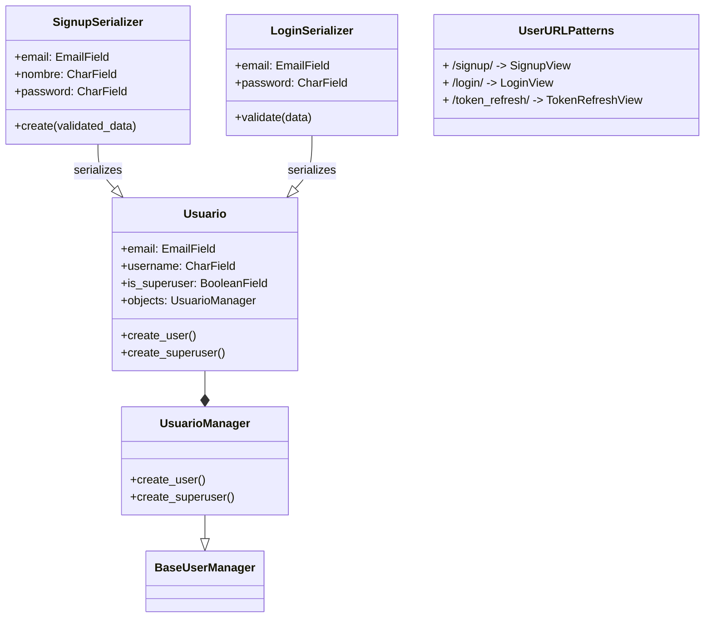

```mermaid
classDiagram
    direction TD

    subgraph Models
        UsuarioManager --|> BaseUserManager
        class Usuario {
            +email: EmailField
            +username: CharField
            +is_superuser: BooleanField
            +objects: UsuarioManager
            +create_user()
            +create_superuser()
        }
        class UsuarioManager{
            +create_user()
            +create_superuser()
        }
        Usuario --* UsuarioManager
    end

    subgraph Serializers
        class SignupSerializer {
	        +email: EmailField
	        +nombre: CharField
            +password: CharField
            +create(validated_data)
        }
        class LoginSerializer {
	        +email: EmailField
	        +password: CharField
	        +validate(data)
        }
        SignupSerializer --|> Usuario : serializes
        LoginSerializer --|> Usuario : serializes
    end

    subgraph URLs
        class UserURLPatterns {
            + /signup/ -> SignupView
            + /login/ -> LoginView
            + /token_refresh/ -> TokenRefreshView
        }
    end
```