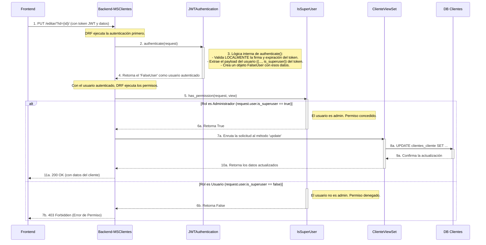

Se realizó el análisis del diagrama únicamente con el endpoint de editar clientes ya que este abarca todas las características comunes al resto (Procesar request, autenticación, permisos de superusuario, etc...)