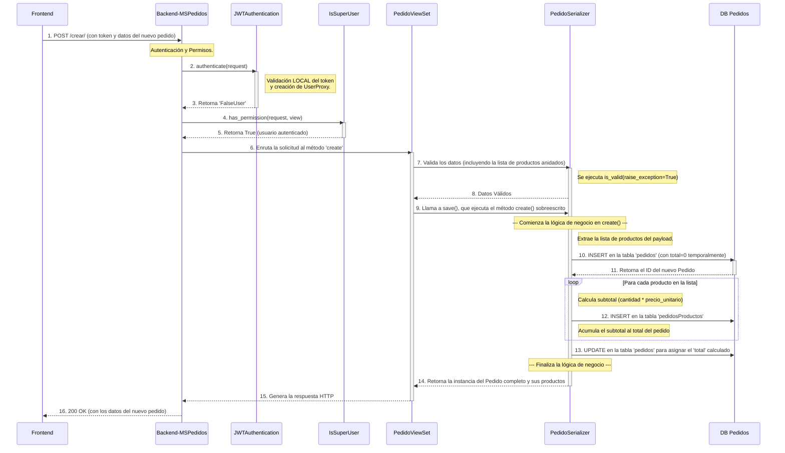

```mermaid
sequenceDiagram
    participant Frontend
    participant BackendPedidos as Backend-MSPedidos
    participant JWTAuthentication
    participant IsAuthenticated as IsSuperUser
    participant PedidoViewSet
    participant PedidoSerializer
    participant Database as DB Pedidos

    Frontend->>BackendPedidos: 1. POST /crear/ (con token y datos del nuevo pedido)
    
    Note over BackendPedidos: Autenticación y Permisos.
    BackendPedidos->>JWTAuthentication: 2. authenticate(request)
    activate JWTAuthentication
    Note right of JWTAuthentication: Validación LOCAL del token<br/>y creación de UserProxy.
    JWTAuthentication-->>BackendPedidos: 3. Retorna 'FalseUser'
    deactivate JWTAuthentication
    
    BackendPedidos->>IsAuthenticated: 4. has_permission(request, view)
    activate IsAuthenticated
    IsAuthenticated-->>BackendPedidos: 5. Retorna True (usuario autenticado)
    deactivate IsAuthenticated
    
    BackendPedidos->>PedidoViewSet: 6. Enruta la solicitud al método 'create'
    activate PedidoViewSet
    
    PedidoViewSet->>PedidoSerializer: 7. Valida los datos (incluyendo la lista de productos anidados)
    activate PedidoSerializer
    Note right of PedidoSerializer: Se ejecuta is_valid(raise_exception=True)
    PedidoSerializer-->>PedidoViewSet: 8. Datos Válidos
    
    PedidoViewSet->>PedidoSerializer: 9. Llama a save(), que ejecuta el método create() sobreescrito
    
    Note over PedidoSerializer: --- Comienza la lógica de negocio en create() ---

    Note right of PedidoSerializer: Extrae la lista de productos del payload.
    
    PedidoSerializer->>Database: 10. INSERT en la tabla 'pedidos' (con total=0 temporalmente)
    activate Database
    Database-->>PedidoSerializer: 11. Retorna el ID del nuevo Pedido
    deactivate Database

    loop Para cada producto en la lista
        Note right of PedidoSerializer: Calcula subtotal (cantidad * precio_unitario)
        PedidoSerializer->>Database: 12. INSERT en la tabla 'pedidosProductos'
        Note right of PedidoSerializer: Acumula el subtotal al total del pedido
    end

    PedidoSerializer->>Database: 13. UPDATE en la tabla 'pedidos' para asignar el 'total' calculado
    
    Note over PedidoSerializer: --- Finaliza la lógica de negocio ---
    
    PedidoSerializer-->>PedidoViewSet: 14. Retorna la instancia del Pedido completo y sus productos
    deactivate PedidoSerializer
    
    PedidoViewSet-->>BackendPedidos: 15. Genera la respuesta HTTP
    deactivate PedidoViewSet
    
    BackendPedidos-->>Frontend: 16. 200 OK (con los datos del nuevo pedido)
```