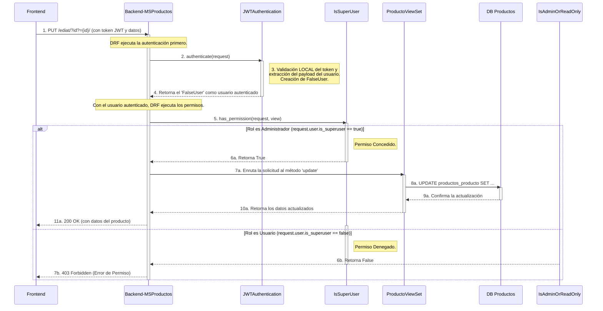

```mermaid
sequenceDiagram
    participant Frontend
    participant BackendProductos as Backend-MSProductos
    participant JWTAuthentication
    participant IsSuperUser
    participant ProductoViewSet
    participant Database as DB Productos

    Frontend->>BackendProductos: 1. PUT /ediat/?id?={id}/ (con token JWT y datos)
    activate BackendProductos
    
    Note over BackendProductos: DRF ejecuta la autenticación primero.
    BackendProductos->>JWTAuthentication: 2. authenticate(request)
    activate JWTAuthentication
    
    Note right of JWTAuthentication: 3. Validación LOCAL del token y<br/>extracción del payload del usuario.<br/>Creación de FalseUser.
    
    JWTAuthentication-->>BackendProductos: 4. Retorna el 'FalseUser' como usuario autenticado
    deactivate JWTAuthentication
    
    Note over BackendProductos: Con el usuario autenticado, DRF ejecuta los permisos.
    BackendProductos->>IsSuperUser: 5. has_permission(request, view)
    activate IsSuperUser

    alt Rol es Administrador (request.user.is_superuser == true)
        Note right of IsSuperUser: Permiso Concedido.
        IsSuperUser-->>BackendProductos: 6a. Retorna True
        deactivate IsSuperUser
        
        BackendProductos->>ProductoViewSet: 7a. Enruta la solicitud al método 'update'
        activate ProductoViewSet
        
        ProductoViewSet->>Database: 8a. UPDATE productos_producto SET ...
        activate Database
        Database-->>ProductoViewSet: 9a. Confirma la actualización
        deactivate Database
        
        ProductoViewSet-->>BackendProductos: 10a. Retorna los datos actualizados
        deactivate ProductoViewSet
        
        BackendProductos-->>Frontend: 11a. 200 OK (con datos del producto)

		activate IsSuperUser
    else Rol es Usuario (request.user.is_superuser == false)
        Note right of IsSuperUser: Permiso Denegado.
        IsAdminOrReadOnly-->>BackendProductos: 6b. Retorna False
        deactivate IsSuperUser
        
        BackendProductos-->>Frontend: 7b. 403 Forbidden (Error de Permiso)
    end
    
    deactivate BackendProductos
```