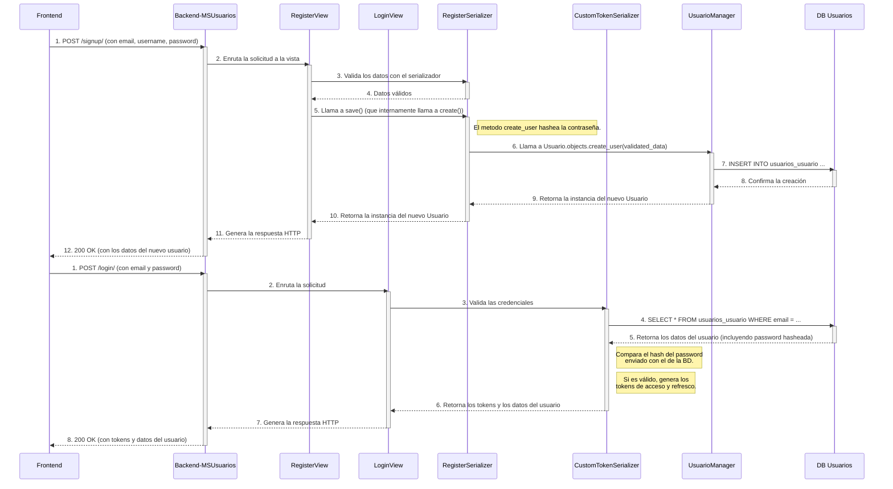

```mermaid
sequenceDiagram
    participant Frontend
    participant Backend as Backend-MSUsuarios
    participant RegisterView
	participant LoginView
    participant RegisterSerializer
    participant CustomSerializer as CustomTokenSerializer
    participant UsuarioManager
    participant Database as DB Usuarios

    Frontend->>Backend: 1. POST /signup/ (con email, username, password)
    activate Backend
    
    Backend->>RegisterView: 2. Enruta la solicitud a la vista
    activate RegisterView
    
    RegisterView->>RegisterSerializer: 3. Valida los datos con el serializador
    activate RegisterSerializer
    RegisterSerializer-->>RegisterView: 4. Datos válidos
    deactivate RegisterSerializer
    
    RegisterView->>RegisterSerializer: 5. Llama a save() (que internamente llama a create())
    activate RegisterSerializer
    
    Note right of RegisterSerializer: El metodo create_user hashea la contraseña.
    RegisterSerializer->>UsuarioManager: 6. Llama a Usuario.objects.create_user(validated_data)
    activate UsuarioManager
    
    UsuarioManager->>Database: 7. INSERT INTO usuarios_usuario ...
    activate Database
    Database-->>UsuarioManager: 8. Confirma la creación
    deactivate Database
    
    UsuarioManager-->>RegisterSerializer: 9. Retorna la instancia del nuevo Usuario
    deactivate UsuarioManager
    
    RegisterSerializer-->>RegisterView: 10. Retorna la instancia del nuevo Usuario
    deactivate RegisterSerializer
    
    RegisterView-->>Backend: 11. Genera la respuesta HTTP
    deactivate RegisterView
    
    Backend-->>Frontend: 12. 200 OK (con los datos del nuevo usuario)
    deactivate Backend
	
	Frontend->>Backend: 1. POST /login/ (con email y password)
	activate Backend 
	Backend->>LoginView: 2. Enruta la solicitud 
	activate LoginView 
	LoginView->>CustomSerializer: 3. Valida las credenciales 
	activate CustomSerializer 
	CustomSerializer->>Database: 4. SELECT * FROM usuarios_usuario WHERE email = ... 
	activate Database 
	Database-->>CustomSerializer: 5. Retorna los datos del usuario (incluyendo password hasheada) 
	deactivate Database 
	Note right of CustomSerializer: Compara el hash del password<br/>enviado con el de la BD. 
	Note right of CustomSerializer: Si es válido, genera los<br/>tokens de acceso y refresco. 
	CustomSerializer-->>LoginView: 6. Retorna los tokens y los datos del usuario 
	deactivate CustomSerializer 
	LoginView-->>Backend: 7. Genera la respuesta HTTP 
	deactivate LoginView 
	Backend-->>Frontend: 8. 200 OK (con tokens y datos del usuario) 
	deactivate Backend
```