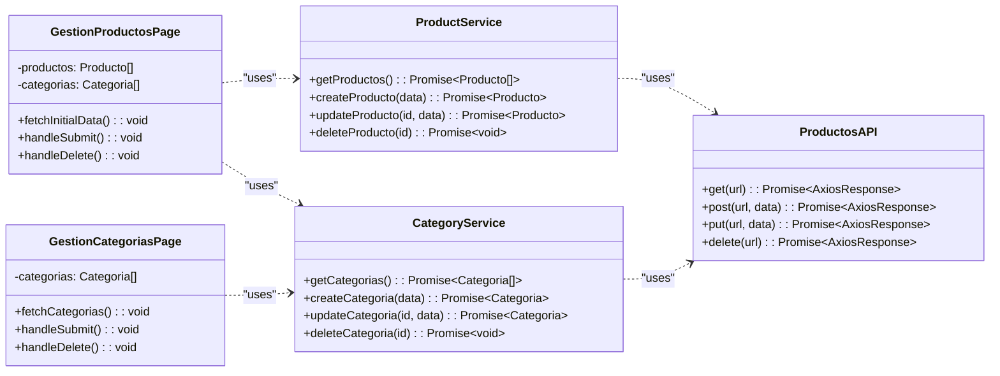

```mermaid
classDiagram
    direction LR

    class GestionProductosPage {
        -productos: Producto[]
        -categorias: Categoria[]
        +fetchInitialData(): void
        +handleSubmit(): void
        +handleDelete(): void
    }

    class GestionCategoriasPage {
        -categorias: Categoria[]
        +fetchCategorias(): void
        +handleSubmit(): void
        +handleDelete(): void
    }

    class ProductService {
        +getProductos(): Promise~Producto[]~
        +createProducto(data): Promise~Producto~
        +updateProducto(id, data): Promise~Producto~
        +deleteProducto(id): Promise~void~
    }

    class CategoryService {
        +getCategorias(): Promise~Categoria[]~
        +createCategoria(data): Promise~Categoria~
        +updateCategoria(id, data): Promise~Categoria~
        +deleteCategoria(id): Promise~void~
    }

    class ProductosAPI {
        +get(url): Promise~AxiosResponse~
        +post(url, data): Promise~AxiosResponse~
        +put(url, data): Promise~AxiosResponse~
        +delete(url): Promise~AxiosResponse~
    }
    
    GestionProductosPage ..> ProductService : "uses"
    GestionProductosPage ..> CategoryService : "uses"
    GestionCategoriasPage ..> CategoryService : "uses"
    ProductService ..> ProductosAPI : "uses"
    CategoryService ..> ProductosAPI : "uses"

```