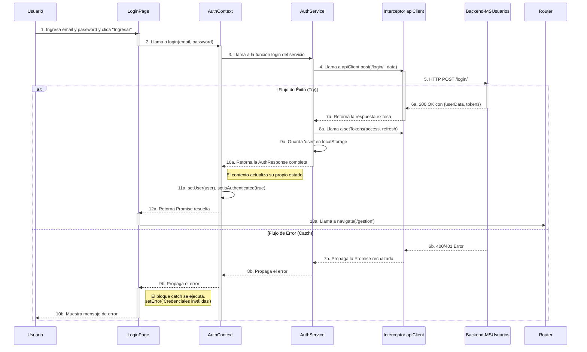

```mermaid
sequenceDiagram
    participant Usuario
    participant LoginPage
    participant AuthContext
    participant AuthService
    participant ApiClient as Interceptor apiClient
    participant Backend as Backend-MSUsuarios
    participant Router

    Usuario->>LoginPage: 1. Ingresa email y password y clica "Ingresar"
    activate LoginPage

    LoginPage->>AuthContext: 2. Llama a login(email, password)
    deactivate LoginPage
    activate AuthContext

    AuthContext->>AuthService: 3. Llama a la función login del servicio
    activate AuthService

    AuthService->>ApiClient: 4. Llama a apiClient.post('/login/', data)
    activate ApiClient
    ApiClient->>Backend: 5. HTTP POST /login/
    activate Backend
    
    alt Flujo de Éxito (Try)
        Backend-->>ApiClient: 6a. 200 OK con {userData, tokens}
        deactivate Backend
        ApiClient-->>AuthService: 7a. Retorna la respuesta exitosa
        deactivate ApiClient
        
        AuthService->>ApiClient: 8a. Llama a setTokens(access, refresh)
        AuthService->>AuthService: 9a. Guarda 'user' en localStorage
        
        AuthService-->>AuthContext: 10a. Retorna la AuthResponse completa
        deactivate AuthService
        
        Note right of AuthContext: El contexto actualiza su propio estado.
        AuthContext->>AuthContext: 11a. setUser(user), setIsAuthenticated(true)
        
        AuthContext-->>LoginPage: 12a. Retorna Promise resuelta
        activate LoginPage
        
        LoginPage->>Router: 13a. Llama a navigate('/gestion')
        deactivate LoginPage
        
    else Flujo de Error (Catch)
        Backend-->>ApiClient: 6b. 400/401 Error
        ApiClient-->>AuthService: 7b. Propaga la Promise rechazada

        AuthService-->>AuthContext: 8b. Propaga el error
        
        AuthContext-->>LoginPage: 9b. Propaga el error
        activate LoginPage
        
        Note right of LoginPage: El bloque catch se ejecuta.<br/>setError('Credenciales inválidas')
        LoginPage-->>Usuario: 10b. Muestra mensaje de error
        deactivate LoginPage
    end
    deactivate AuthContext
```