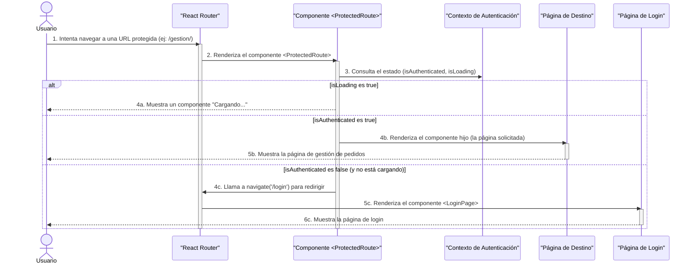

```mermaid
sequenceDiagram
    actor Usuario
    participant Router as "React Router"
    participant ProtectedRoute as "Componente <ProtectedRoute>"
    participant AuthContext as "Contexto de Autenticación"
    participant PaginaProtegida as "Página de Destino"
    participant LoginPage as "Página de Login"

    Usuario->>Router: 1. Intenta navegar a una URL protegida (ej: /gestion/)
    activate Router

    Router->>ProtectedRoute: 2. Renderiza el componente <ProtectedRoute>
    activate ProtectedRoute
    
    ProtectedRoute->>AuthContext: 3. Consulta el estado (isAuthenticated, isLoading)
    
    alt isLoading es true
        ProtectedRoute-->>Usuario: 4a. Muestra un componente "Cargando..."
    else isAuthenticated es true
        ProtectedRoute->>PaginaProtegida: 4b. Renderiza el componente hijo (la página solicitada)
        activate PaginaProtegida
        PaginaProtegida-->>Usuario: 5b. Muestra la página de gestión de pedidos
        deactivate PaginaProtegida
    else isAuthenticated es false (y no está cargando)
        ProtectedRoute->>Router: 4c. Llama a navigate('/login') para redirigir
        
        Router->>LoginPage: 5c. Renderiza el componente <LoginPage>
        activate LoginPage
        LoginPage-->>Usuario: 6c. Muestra la página de login
        deactivate LoginPage
    end

    deactivate ProtectedRoute
    deactivate Router

```