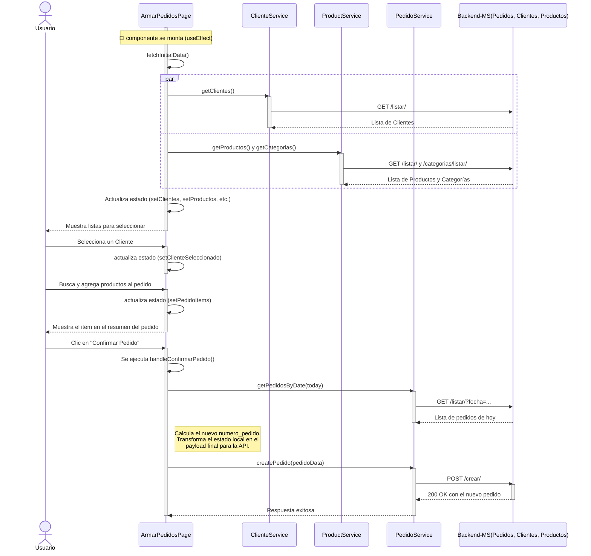

```mermaid
sequenceDiagram
    actor Usuario
    participant page as ArmarPedidosPage
    participant clienteService as ClienteService
    participant productService as ProductService
    participant pedidoService as PedidoService
    participant Backend as Backend-MS(Pedidos, Clientes, Productos)

    %% --- 1. Carga Inicial de Datos ---
    activate page
    Note over page: El componente se monta (useEffect)
    page->>page: fetchInitialData()
    
    par
        page->>clienteService: getClientes()
        activate clienteService
        clienteService->>Backend: GET /listar/
        Backend-->>clienteService: Lista de Clientes
        deactivate clienteService
    and
        page->>productService: getProductos() y getCategorias()
        activate productService
        productService->>Backend: GET /listar/ y /categorias/listar/
        Backend-->>productService: Lista de Productos y Categorías
        deactivate productService
    end
    page->>page: Actualiza estado (setClientes, setProductos, etc.)
    page-->>Usuario: Muestra listas para seleccionar
    deactivate page
    
    %% --- 2. Selección y Armado ---
    Usuario->>page: Selecciona un Cliente
    activate page
    page->>page: actualiza estado (setClienteSeleccionado)
    deactivate page
    
    Usuario->>page: Busca y agrega productos al pedido
    activate page
    page->>page: actualiza estado (setPedidoItems)
    page-->>Usuario: Muestra el item en el resumen del pedido
    deactivate page

    %% --- 3. Confirmación del Pedido ---
    Usuario->>page: Clic en "Confirmar Pedido"
    activate page
    page->>page: Se ejecuta handleConfirmarPedido()
    
    page->>pedidoService: getPedidosByDate(today)
    activate pedidoService
    pedidoService->>Backend: GET /listar/?fecha=...
    Backend-->>pedidoService: Lista de pedidos de hoy
    deactivate pedidoService
    
    Note right of page: Calcula el nuevo numero_pedido.<br/>Transforma el estado local en el<br/>payload final para la API.
    
    page->>pedidoService: createPedido(pedidoData)
    activate pedidoService
    pedidoService->>Backend: POST /crear/
    activate Backend
    Backend-->>pedidoService: 200 OK con el nuevo pedido
    deactivate Backend
    pedidoService-->>page: Respuesta exitosa
    deactivate pedidoService
    deactivate page
```