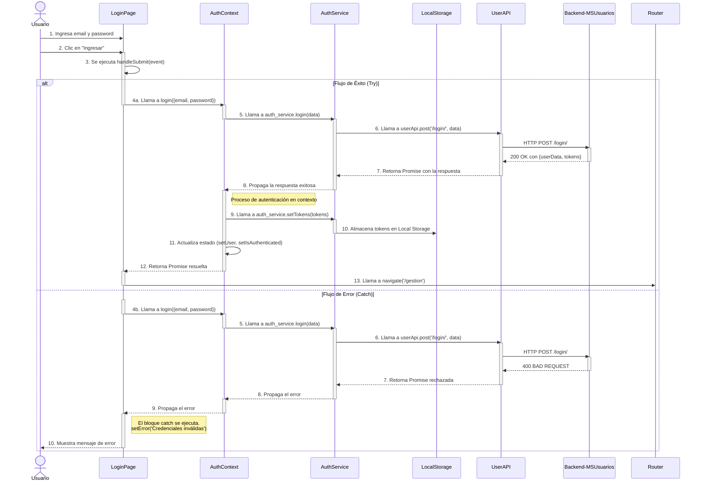

```mermaid
sequenceDiagram
    actor Usuario
    participant loginPage as LoginPage
    participant authContext as AuthContext
    participant authService as AuthService
    participant localStorage as LocalStorage
    participant userApi as UserAPI
    participant Backend as Backend-MSUsuarios
    participant router as Router

    Usuario->>loginPage: 1. Ingresa email y password
    Usuario->>loginPage: 2. Clic en "Ingresar"
    activate loginPage

    loginPage->>loginPage: 3. Se ejecuta handleSubmit(event)

    %% Bloque 'alt/else' para mostrar la lógica try/catch del login
    alt Flujo de Éxito (Try)
        loginPage->>authContext: 4a. Llama a login({email, password})
        deactivate loginPage
        activate authContext

        authContext->>authService: 5. Llama a auth_service.login(data)
        deactivate authContext
        activate authService

        authService->>userApi: 6. Llama a userApi.post('/login/', data)
        activate userApi
        userApi->>Backend: HTTP POST /login/
        activate Backend
        Backend-->>userApi: 200 OK con {userData, tokens}
        deactivate Backend
        userApi-->>authService: 7. Retorna Promise con la respuesta
        deactivate userApi

        authService-->>authContext: 8. Propaga la respuesta exitosa
        deactivate authService
        activate authContext

        Note right of authContext: Proceso de autenticación en contexto
        authContext->>authService: 9. Llama a auth_service.setTokens(tokens)
        activate authService
        authService->>localStorage: 10. Almacena tokens en Local Storage
        deactivate authService

        authContext->>authContext: 11. Actualiza estado (setUser, setIsAuthenticated)

        authContext-->>loginPage: 12. Retorna Promise resuelta
        deactivate authContext
        activate loginPage

        loginPage->>router: 13. Llama a navigate('/gestion')
        deactivate loginPage

    else Flujo de Error (Catch)
        activate loginPage
        loginPage->>authContext: 4b. Llama a login({email, password})
        deactivate loginPage
        activate authContext

        authContext->>authService: 5. Llama a auth_service.login(data)
        deactivate authContext
        activate authService

        authService->>userApi: 6. Llama a userApi.post('/login/', data)
        activate userApi
        userApi->>Backend: HTTP POST /login/
        activate Backend
        Backend-->>userApi: 400 BAD REQUEST
        deactivate Backend
        userApi-->>authService: 7. Retorna Promise rechazada
        deactivate userApi

        authService-->>authContext: 8. Propaga el error
        deactivate authService
        activate authContext

        authContext-->>loginPage: 9. Propaga el error
        deactivate authContext
        activate loginPage

        Note right of loginPage: El bloque catch se ejecuta.<br/>setError('Credenciales inválidas')
        loginPage-->>Usuario: 10. Muestra mensaje de error
        deactivate loginPage
    end
```