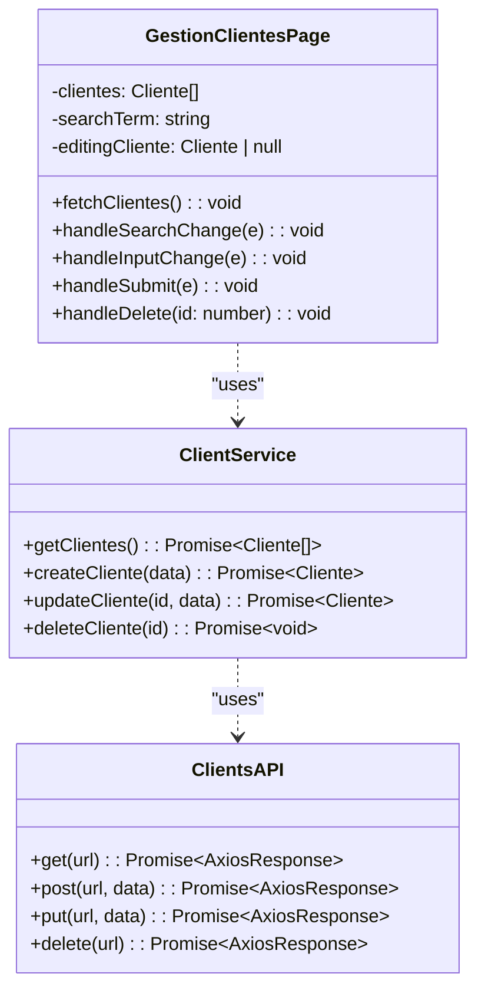

```mermaid
classDiagram
    class GestionClientesPage {
        -clientes: Cliente[]
        -searchTerm: string
        -editingCliente: Cliente | null
        +fetchClientes(): void
        +handleSearchChange(e): void
        +handleInputChange(e): void
        +handleSubmit(e): void
        +handleDelete(id: number): void
    }

    class ClientService {
        +getClientes(): Promise~Cliente[]~
        +createCliente(data): Promise~Cliente~
        +updateCliente(id, data): Promise~Cliente~
        +deleteCliente(id): Promise~void~
    }

    class ClientsAPI {
        +get(url): Promise~AxiosResponse~
        +post(url, data): Promise~AxiosResponse~
        +put(url, data): Promise~AxiosResponse~
        +delete(url): Promise~AxiosResponse~
    }

    GestionClientesPage ..> ClientService : "uses"
    ClientService ..> ClientsAPI : "uses"
```