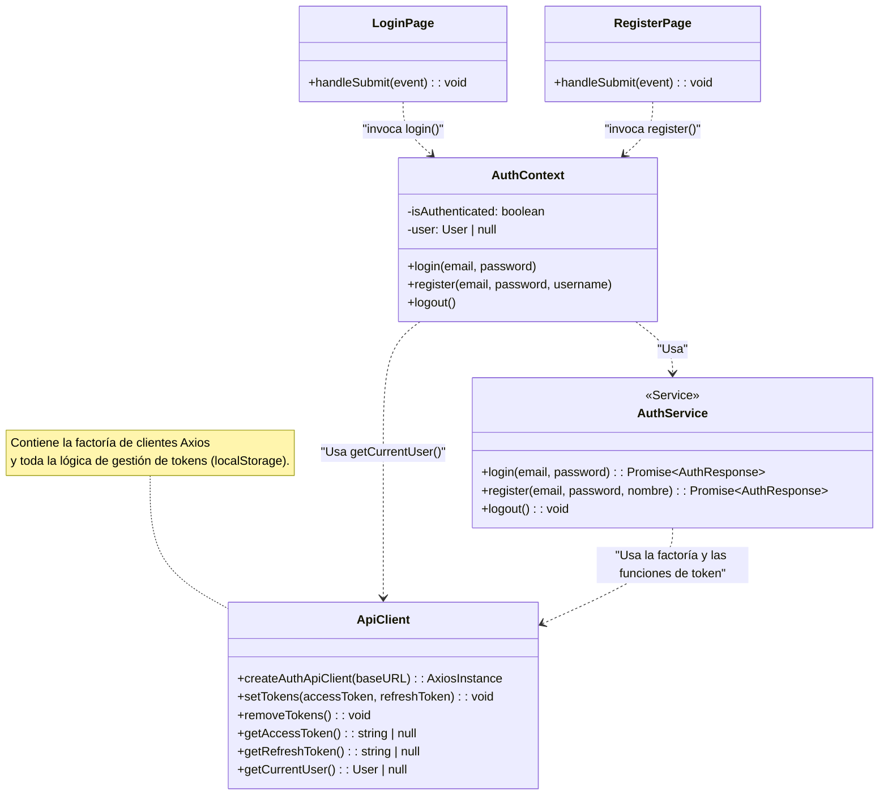

```mermaid
classDiagram
    direction TD

    class LoginPage {
        +handleSubmit(event): void
    }
    
    class RegisterPage {
        +handleSubmit(event): void
    }

    class AuthContext {
        -isAuthenticated: boolean
        -user: User | null
        +login(email, password)
        +register(email, password, username)
        +logout()
    }

    class AuthService {
        <<Service>>
        +login(email, password): Promise~AuthResponse~
        +register(email, password, nombre): Promise~AuthResponse~
        +logout(): void
    }

    class ApiClient {
        +createAuthApiClient(baseURL): AxiosInstance
        +setTokens(accessToken, refreshToken): void
        +removeTokens(): void
        +getAccessToken(): string | null
        +getRefreshToken(): string | null
        +getCurrentUser(): User | null
    }
    
    note for ApiClient "Contiene la factoría de clientes Axios<br/>y toda la lógica de gestión de tokens (localStorage)."

    LoginPage ..> AuthContext : "invoca login()"
    RegisterPage ..> AuthContext : "invoca register()"
    
    AuthContext ..> AuthService : "Usa"
    AuthContext ..> ApiClient : "Usa getCurrentUser()"

    AuthService ..> ApiClient : "Usa la factoría y las funciones de token"
```
