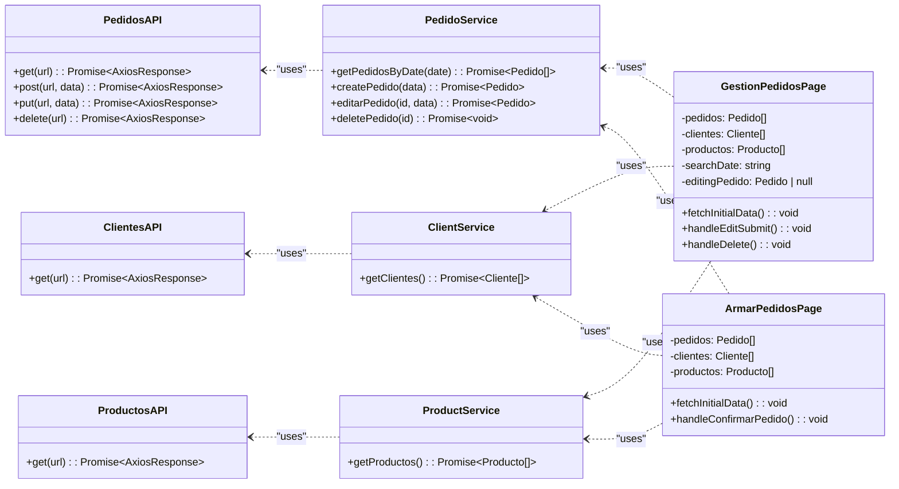

```mermaid
classDiagram
    direction RL

    class GestionPedidosPage {
        -pedidos: Pedido[]
        -clientes: Cliente[]
        -productos: Producto[]
        -searchDate: string
        -editingPedido: Pedido | null
        +fetchInitialData(): void
        +handleEditSubmit(): void
        +handleDelete(): void
    }
    
    class ArmarPedidosPage {
        -pedidos: Pedido[]
        -clientes: Cliente[]
        -productos: Producto[]
        +fetchInitialData(): void
        +handleConfirmarPedido(): void
    }

    class PedidoService {
        +getPedidosByDate(date): Promise~Pedido[]~
        +createPedido(data): Promise~Pedido~
        +editarPedido(id, data): Promise~Pedido~
        +deletePedido(id): Promise~void~
    }

    class ClientService {
        +getClientes(): Promise~Cliente[]~
    }
    
    class ProductService {
        +getProductos(): Promise~Producto[]~
    }

    class PedidosAPI {
        +get(url): Promise~AxiosResponse~
        +post(url, data): Promise~AxiosResponse~
        +put(url, data): Promise~AxiosResponse~
        +delete(url): Promise~AxiosResponse~
    }
    class ClientesAPI {
        +get(url): Promise~AxiosResponse~
    }
    class ProductosAPI {
        +get(url): Promise~AxiosResponse~
    }
    

    GestionPedidosPage ..> PedidoService : "uses"
    GestionPedidosPage ..> ClientService : "uses"
    GestionPedidosPage ..> ProductService : "uses"
    ArmarPedidosPage ..> PedidoService : "uses"
    ArmarPedidosPage ..> ClientService : "uses"
    ArmarPedidosPage ..> ProductService : "uses"
    
    PedidoService ..> PedidosAPI : "uses"
    ClientService ..> ClientesAPI : "uses"
    ProductService ..> ProductosAPI : "uses"
```