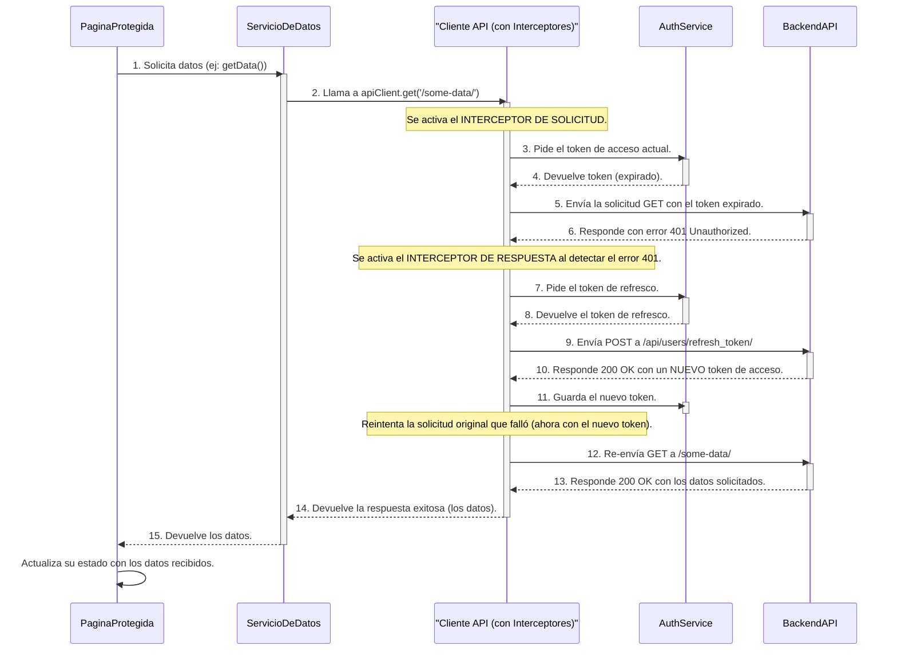

```mermaid
sequenceDiagram
    participant PaginaProtegida
    participant ServicioDeDatos
    participant apiClient as "Cliente API (con Interceptores)"
    participant authService as AuthService
    participant Backend as BackendAPI

    PaginaProtegida->>ServicioDeDatos: 1. Solicita datos (ej: getData())
    activate ServicioDeDatos

    ServicioDeDatos->>apiClient: 2. Llama a apiClient.get('/some-data/')
    activate apiClient

    Note over apiClient: Se activa el INTERCEPTOR DE SOLICITUD.
    apiClient->>authService: 3. Pide el token de acceso actual.
    activate authService
    authService-->>apiClient: 4. Devuelve token (expirado).
    deactivate authService
    
    apiClient->>Backend: 5. Envía la solicitud GET con el token expirado.
    activate Backend
    Backend-->>apiClient: 6. Responde con error 401 Unauthorized.
    deactivate Backend

    Note over apiClient: Se activa el INTERCEPTOR DE RESPUESTA al detectar el error 401.
    apiClient->>authService: 7. Pide el token de refresco.
    activate authService
    authService-->>apiClient: 8. Devuelve el token de refresco.
    deactivate authService

    apiClient->>Backend: 9. Envía POST a /api/users/refresh_token/
    activate Backend
    Backend-->>apiClient: 10. Responde 200 OK con un NUEVO token de acceso.
    deactivate Backend
    
    apiClient->>authService: 11. Guarda el nuevo token.
    activate authService
    deactivate authService
    
    Note over apiClient: Reintenta la solicitud original que falló (ahora con el nuevo token).
    apiClient->>Backend: 12. Re-envía GET a /some-data/
    activate Backend
    Backend-->>apiClient: 13. Responde 200 OK con los datos solicitados.
    deactivate Backend
    
    apiClient-->>ServicioDeDatos: 14. Devuelve la respuesta exitosa (los datos).
    deactivate apiClient
    
    ServicioDeDatos-->>PaginaProtegida: 15. Devuelve los datos.
    deactivate ServicioDeDatos
    
    PaginaProtegida->>PaginaProtegida: Actualiza su estado con los datos recibidos.
```