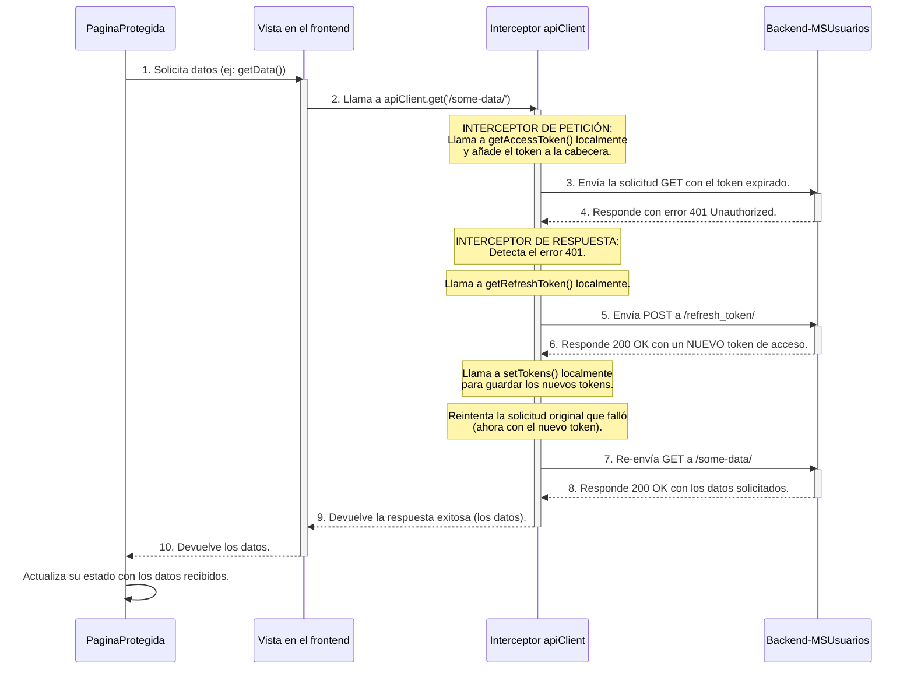

Ejemplo de flujo para el token de refresco:

```mermaid
sequenceDiagram
    participant PaginaProtegida
    participant ServicioDeDatos as Vista en el frontend
    participant apiClient as Interceptor apiClient
    participant Backend as Backend-MSUsuarios

    PaginaProtegida->>ServicioDeDatos: 1. Solicita datos (ej: getData())
    activate ServicioDeDatos

    ServicioDeDatos->>apiClient: 2. Llama a apiClient.get('/some-data/')
    activate apiClient

    Note over apiClient: INTERCEPTOR DE PETICIÓN:<br/>Llama a getAccessToken() localmente<br/>y añade el token a la cabecera.
    
    apiClient->>Backend: 3. Envía la solicitud GET con el token expirado.
    activate Backend
    Backend-->>apiClient: 4. Responde con error 401 Unauthorized.
    deactivate Backend

    Note over apiClient: INTERCEPTOR DE RESPUESTA:<br/>Detecta el error 401.
    Note over apiClient: Llama a getRefreshToken() localmente.

    apiClient->>Backend: 5. Envía POST a /refresh_token/
    activate Backend
    Backend-->>apiClient: 6. Responde 200 OK con un NUEVO token de acceso.
    deactivate Backend
    
    Note over apiClient: Llama a setTokens() localmente<br/>para guardar los nuevos tokens.
    
    Note over apiClient: Reintenta la solicitud original que falló<br/>(ahora con el nuevo token).
    apiClient->>Backend: 7. Re-envía GET a /some-data/
    activate Backend
    Backend-->>apiClient: 8. Responde 200 OK con los datos solicitados.
    deactivate Backend
    
    apiClient-->>ServicioDeDatos: 9. Devuelve la respuesta exitosa (los datos).
    deactivate apiClient
    
    ServicioDeDatos-->>PaginaProtegida: 10. Devuelve los datos.
    deactivate ServicioDeDatos
    
    PaginaProtegida->>PaginaProtegida: Actualiza su estado con los datos recibidos.
```