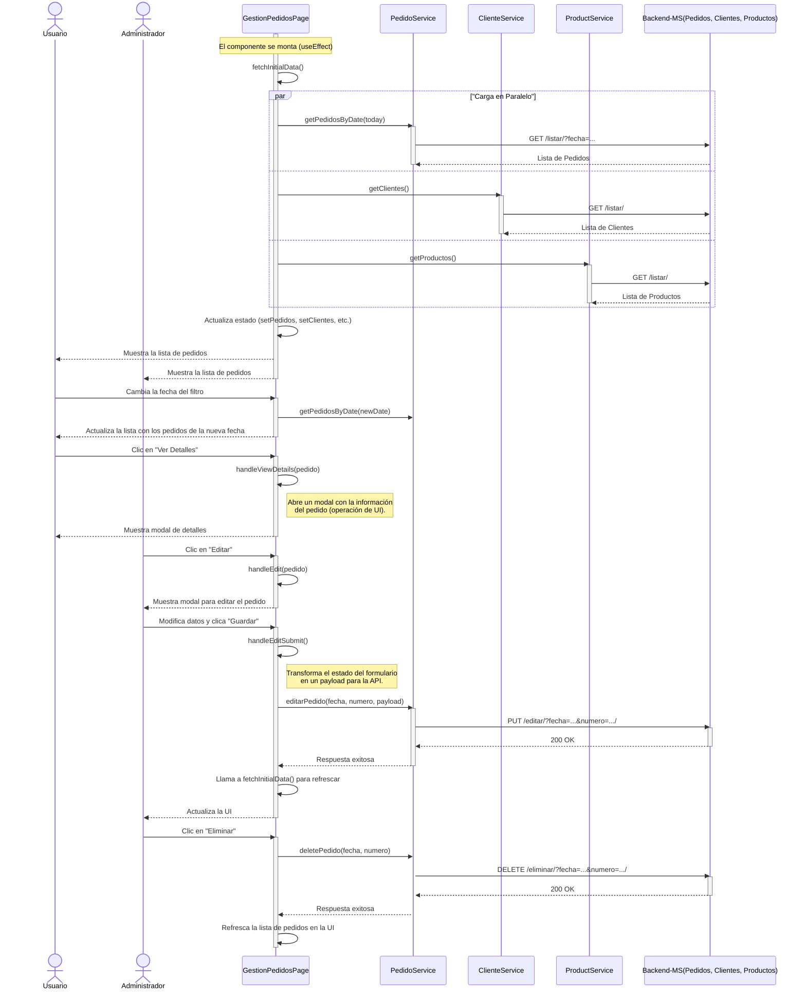

```mermaid
sequenceDiagram
    actor Usuario
    actor Administrador
    participant page as GestionPedidosPage
    participant pedidoService as PedidoService
    participant clienteService as ClienteService
    participant productService as ProductService
    participant Backend as Backend-MS(Pedidos, Clientes, Productos)
    
    %% --- Carga Inicial de Datos (Común para todos) ---
    activate page
    Note over page: El componente se monta (useEffect)
    page->>page: fetchInitialData()
    
    par "Carga en Paralelo"
        page->>pedidoService: getPedidosByDate(today)
        activate pedidoService
        pedidoService->>Backend: GET /listar/?fecha=...
        Backend-->>pedidoService: Lista de Pedidos
        deactivate pedidoService
    and
        page->>clienteService: getClientes()
        activate clienteService
        clienteService->>Backend: GET /listar/
        Backend-->>clienteService: Lista de Clientes
        deactivate clienteService
    and 
        page->>productService: getProductos()
        activate productService
        productService->>Backend: GET /listar/
        Backend-->>productService: Lista de Productos
        deactivate productService
    end
    page->>page: Actualiza estado (setPedidos, setClientes, etc.)
    page-->>Usuario: Muestra la lista de pedidos
    page-->>Administrador: Muestra la lista de pedidos
    deactivate page
    %% --- Fin de Carga Inicial ---

    %% --- Actividades Comunes (Usuario y Administrador) ---
    Usuario->>page: Cambia la fecha del filtro
    activate page
    page->>pedidoService: getPedidosByDate(newDate)
    page-->>Usuario: Actualiza la lista con los pedidos de la nueva fecha
    deactivate page

    Usuario->>page: Clic en "Ver Detalles"
    activate page
    page->>page: handleViewDetails(pedido)
    Note right of page: Abre un modal con la información<br/>del pedido (operación de UI).
    page-->>Usuario: Muestra modal de detalles
    deactivate page
    %% --- Fin de Actividades Comunes ---

    Administrador->>page: Clic en "Editar"
    activate page
    page->>page: handleEdit(pedido)
    page-->>Administrador: Muestra modal para editar el pedido
    deactivate page

    Administrador->>page: Modifica datos y clica "Guardar"
    activate page
    page->>page: handleEditSubmit()
    Note right of page: Transforma el estado del formulario<br/>en un payload para la API.
    page->>pedidoService: editarPedido(fecha, numero, payload)
    activate pedidoService
    pedidoService->>Backend: PUT /editar/?fecha=...&numero=.../
    activate Backend
    Backend-->>pedidoService: 200 OK
    deactivate Backend
    pedidoService-->>page: Respuesta exitosa
    deactivate pedidoService
    page->>page: Llama a fetchInitialData() para refrescar
    page-->>Administrador: Actualiza la UI
    deactivate page

    Administrador->>page: Clic en "Eliminar"
    activate page
    page->>pedidoService: deletePedido(fecha, numero)
    activate pedidoService
    pedidoService->>Backend: DELETE /eliminar/?fecha=...&numero=.../
    activate Backend
    Backend-->>pedidoService: 200 OK
    deactivate Backend
    pedidoService-->>page: Respuesta exitosa
    page->>page: Refresca la lista de pedidos en la UI
    deactivate page
    %% --- Fin de Actividades de Administrador ---
```