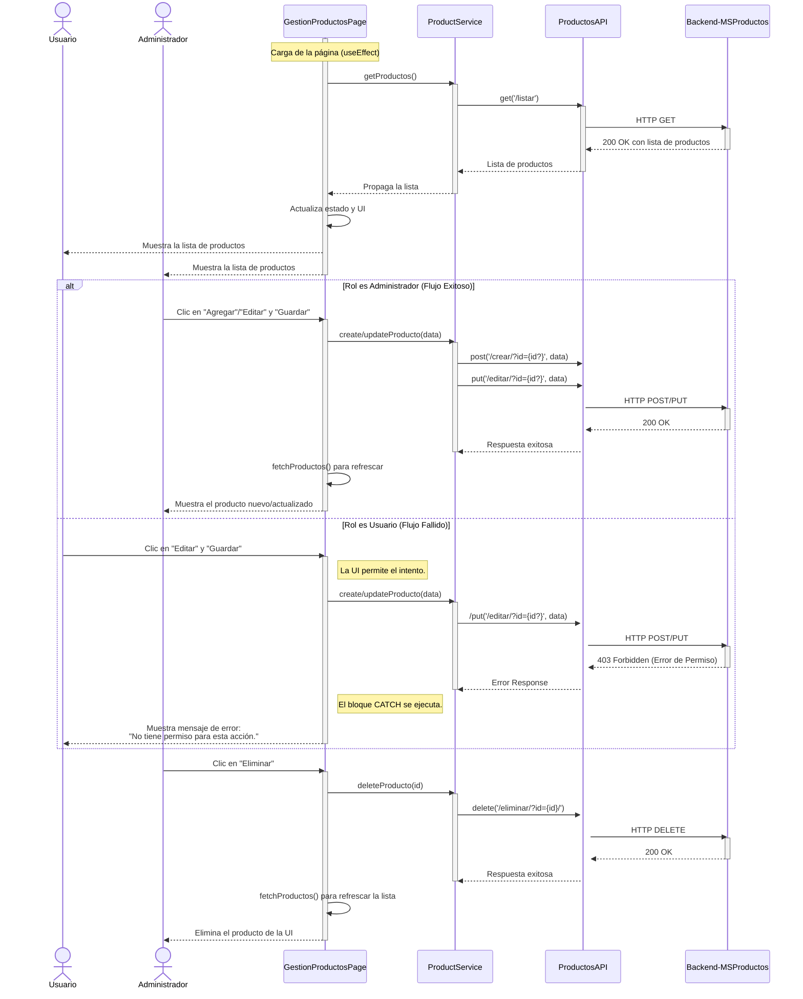

```mermaid
sequenceDiagram
    actor Usuario
    actor Administrador
    participant page as GestionProductosPage
    participant productService as ProductService
    participant productosAPI as ProductosAPI
    participant Backend as Backend-MSProductos

    %% --- Carga Inicial de Datos (Común y exitoso para ambos roles) ---
    activate page
    Note over page: Carga de la página (useEffect)
    page->>productService: getProductos()
    activate productService
    productService->>productosAPI: get('/listar')
    activate productosAPI
    productosAPI->>Backend: HTTP GET
    activate Backend
    Backend-->>productosAPI: 200 OK con lista de productos
    deactivate Backend
    productosAPI-->>productService: Lista de productos
    deactivate productosAPI
    productService-->>page: Propaga la lista
    deactivate productService
    page->>page: Actualiza estado y UI
    page-->>Usuario: Muestra la lista de productos
    page-->>Administrador: Muestra la lista de productos
    deactivate page
    %% --- Fin de Carga Inicial ---

    %% --- Intento de Creación/Edición de Producto ---
    alt Rol es Administrador (Flujo Exitoso)
        Administrador->>page: Clic en "Agregar"/"Editar" y "Guardar"
        activate page
        page->>productService: create/updateProducto(data)
        activate productService
        productService->>productosAPI: post('/crear/?id={id?}', data)
        productService->>productosAPI: put('/editar/?id={id?}', data)
        activate productosAPI
        productosAPI->>Backend: HTTP POST/PUT
        activate Backend
        Backend-->>productosAPI: 200 OK 
        deactivate Backend
        productosAPI-->>productService: Respuesta exitosa
        deactivate productService
        page->>page: fetchProductos() para refrescar
        page-->>Administrador: Muestra el producto nuevo/actualizado
        deactivate page
    else Rol es Usuario (Flujo Fallido)
        Usuario->>page: Clic en "Editar" y "Guardar"
        activate page
        Note right of page: La UI permite el intento.
        page->>productService: create/updateProducto(data)
        activate productService
        productService->>productosAPI: /put('/editar/?id={id?}', data)
        activate productosAPI
        productosAPI->>Backend: HTTP POST/PUT
        activate Backend
        Backend-->>productosAPI: 403 Forbidden (Error de Permiso)
        deactivate Backend
        productosAPI-->>productService: Error Response
        deactivate productService
        Note right of page: El bloque CATCH se ejecuta.
        page-->>Usuario: Muestra mensaje de error:<br/>"No tiene permiso para esta acción."
        deactivate page
    end
    %% --- Fin de Intento de Creación/Edición ---

    %% --- Intento de Eliminación de Producto (Solo Administrador) ---
    Administrador->>page: Clic en "Eliminar"
    activate page
    page->>productService: deleteProducto(id)
    activate productService
    productService->>productosAPI: delete('/eliminar/?id={id}/')
    activate productosAPI
    productosAPI->>Backend: HTTP DELETE
    activate Backend
    Backend-->>productosAPI: 200 OK
    deactivate Backend
    productosAPI-->>productService: Respuesta exitosa
    deactivate productService
    page->>page: fetchProductos() para refrescar la lista
    page-->>Administrador: Elimina el producto de la UI
    deactivate page
    %% --- Fin de Intento de Eliminación ---
```