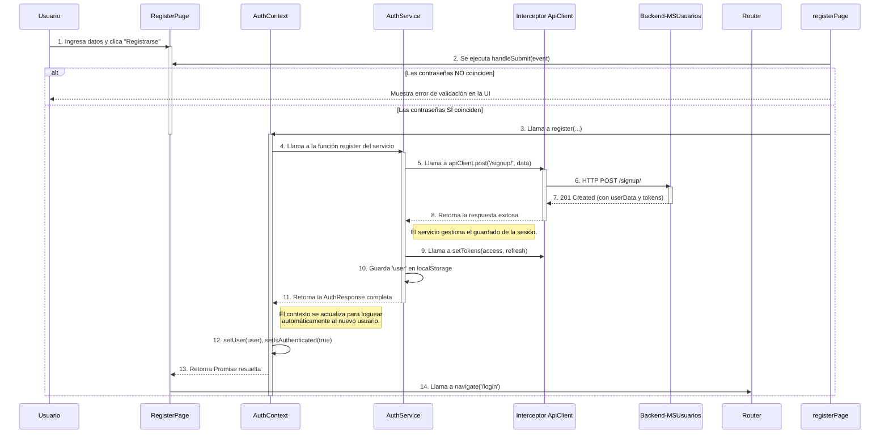

```mermaid
sequenceDiagram
    participant Usuario
    participant RegisterPage
    participant AuthContext
    participant AuthService
    participant ApiClient as Interceptor ApiClient
    participant Backend as Backend-MSUsuarios
    participant Router

    Usuario->>RegisterPage: 1. Ingresa datos y clica "Registrarse"
    activate RegisterPage

    registerPage->>RegisterPage: 2. Se ejecuta handleSubmit(event)

    alt Las contraseñas NO coinciden
        registerPage-->>Usuario: Muestra error de validación en la UI
    else Las contraseñas SÍ coinciden
        registerPage->>AuthContext: 3. Llama a register(...)
        deactivate RegisterPage
        activate AuthContext

        AuthContext->>AuthService: 4. Llama a la función register del servicio
        activate AuthService

        AuthService->>ApiClient: 5. Llama a apiClient.post('/signup/', data)
        activate ApiClient
        ApiClient->>Backend: 6. HTTP POST /signup/
        activate Backend
        Backend-->>ApiClient: 7. 201 Created (con userData y tokens)
        deactivate Backend
        ApiClient-->>AuthService: 8. Retorna la respuesta exitosa
        deactivate ApiClient

        Note right of AuthService: El servicio gestiona el guardado de la sesión.
        AuthService->>ApiClient: 9. Llama a setTokens(access, refresh)
        AuthService->>AuthService: 10. Guarda 'user' en localStorage

        AuthService-->>AuthContext: 11. Retorna la AuthResponse completa
        deactivate AuthService

        Note right of AuthContext: El contexto se actualiza para loguear<br/>automáticamente al nuevo usuario.
        AuthContext->>AuthContext: 12. setUser(user), setIsAuthenticated(true)

        AuthContext-->>RegisterPage: 13. Retorna Promise resuelta

        RegisterPage->>Router: 14. Llama a navigate('/login')
    end
    deactivate AuthContext
```